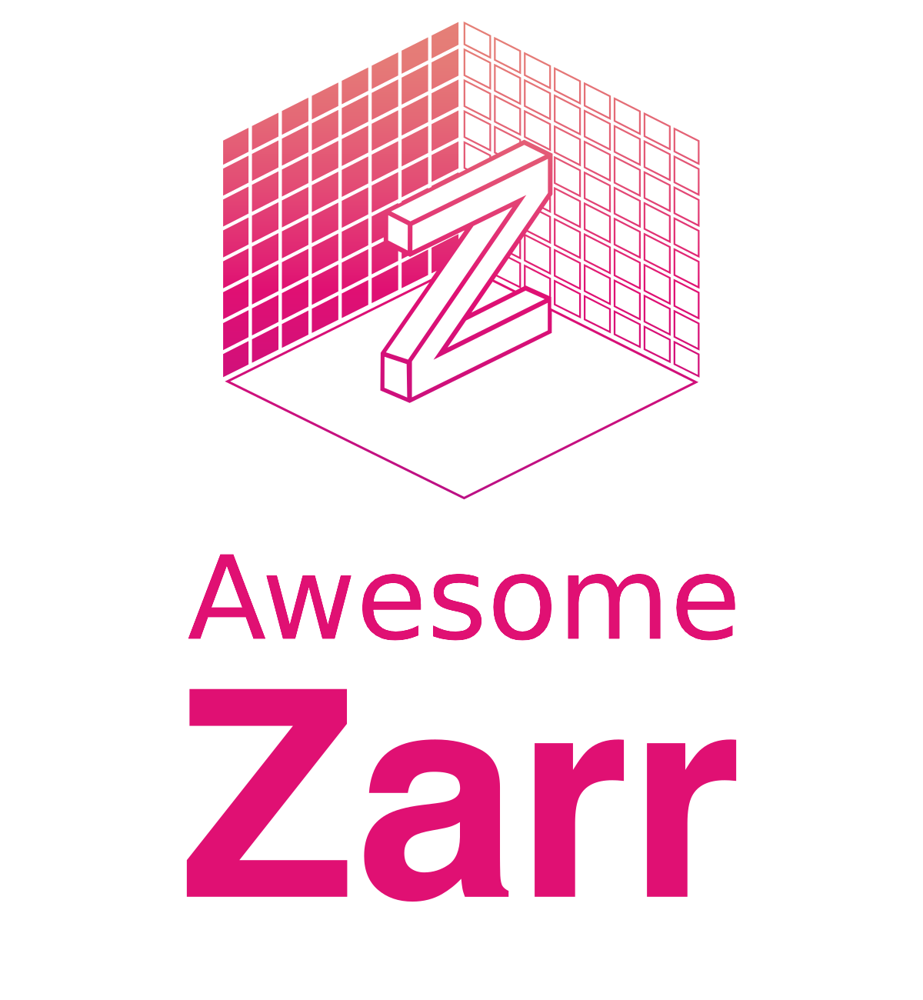

# Awesome-Zarr

Zarr is a cloud-native, chunked, compressed, and hierarchical array data format.

# Contents
[Resources](#resources)
- [Existing resources](#existing-resources)
- [Introductory videos](#introductory-videos)
- [Zarr V3](#zarr-v3)
- [Libraries](#libraries)
- [Platforms](#platforms)
- [Articles](#articles)
- [Talks & Videos](#talks--videos)
- [Life sciences](#life-sciences)

[Topics](#topics)
- [Zarr & other array data formats](#zarr--other-array-data-formats)
- [GeoZarr](#geozarr)
- [Zarr & STAC](#zarr--stac)

# Resources

## Existing resources
The [Zarr website](https://zarr.dev/) is already an excellent resource for learning about Zarr and its ecosystem.
This list is intended to complement the website with a curated and opinionated list of resources.

This list focuses on Geo/Earth Sciences, but is not limited to that domain.

### Existing lists
Lists
- The Zarr website already contains great lists:   [Zarr Implementations](https://zarr.dev/implementations/), [Zarr Datasets](https://zarr.dev/datasets/), [Zarr metadata conventions](https://zarr.dev/conventions/)
- [Zarr tutorials (zarr-developers/tutorials)](https://github.com/zarr-developers/tutorials)
- [Projects using Zarr (zarr-developers/community#19)](https://github.com/zarr-developers/community/issues/19)
- [Beautiful Zarr (zarr-developers/beautiful-zarr)](https://github.com/zarr-developers/beautiful-zarr)
- See playlists & lists in [Talks & Videos](#talks--videos)

## Introductory videos
[Introductory talks Youtube playlist](https://www.youtube.com/playlist?list=PLvkeNUPrCU04Xvcph4ErxsRkZq28Oucr7)

Two excellent and up-to-date introductory talks:
- [Sanket Verma: The Beauty of Zarr](https://www.youtube.com/watch?v=OYaMi9WnQpA&ab_channel=PyData)
- [Ryan Abernathey: State of Zarr](https://www.youtube.com/watch?v=1owtGSkNLQU&ab_channel=Cloud-NativeGeospatialFoundation)

## Zarr V3
[Zarr V3](https://zarr-specs.readthedocs.io/en/latest/v3/core/v3.0.html) is the upcoming version of Zarr. It is a major update that will bring many new features and improvements. 

If you're getting into Zarr now, it might be a good idea to start with Zarr V3.

For an excellent in-depth overview, see the [ESIP](https://www.esipfed.org/) series of talks
- [2023-03-27 ESIP Cloud Computing Cluster: Zarr - The Next Generation](https://www.youtube.com/watch?v=50_LwbIUXi0&ab_channel=ESIP)
- [2023-04-24 ESIP Cloud Computing Cluster: Next Generation of Zarr Part 2/3 GeoZarr and Zarr Sharding](https://www.youtube.com/watch?v=a4-vmJRQcrg&ab_channel=ESIP)
- [2023-05-22 ESIP CCC: Next Gen Zarr Part 3/3: accumulation proposal, Kerchunk and Pangeo-Forge](https://www.youtube.com/watch?v=ROsHdJI3-yw&ab_channel=ESIP)

## Libraries
This list contains libraries that directly relate to Zarr in some way

For implementations of Zarr, see [Zarr Implementations](https://zarr.dev/implementations/).
- [kerchunk](https://fsspec.github.io/kerchunk/), see [kerchunk section](#kerchunk)
- [xpublish](https://github.com/xpublish-community/xpublish): Exposing as and consuming Zarr through a REST API
    - See also routers at [xpublish-community](https://github.com/xpublish-community), e.g. [xpublish-opendap](https://github.com/xpublish-community/xpublish-opendap)
    - [Improving Access to NOAA NOS Model Data with Kerchunk and Xpublish](https://www.youtube.com/watch?v=Bxkg6LJpKyc&ab_channel=Pangeo)
- [ndpyramid](https://github.com/carbonplan/ndpyramid): utility for generating ND array pyramids using Xarray and Zarr

Storage & I/O
- [Tensorstore](https://google.github.io/tensorstore/) and [xarray-tensorstore](https://github.com/google/xarray-tensorstore/): library for efficiently reading and writing large multi-dimensional arrays, has Zarr API
- [KivkIO](https://github.com/rapidsai/kvikio/): C++ and Python bindings to [cuFile](https://docs.nvidia.com/gpudirect-storage/api-reference-guide/index.html), enabling [GPUDirect Storage](https://developer.nvidia.com/blog/gpudirect-storage/)
- [rechunker](https://github.com/pangeo-data/rechunker): disk-to-disk transformation for chunked arrays
- [xpartition](https://github.com/spencerkclark/xpartition): writing large xarray datasets to Zarr. Works around shortcomings of Dask ([distributed#6360](https://github.com/dask/distributed/issues/6360))

ETL
- [Xarray](https://docs.xarray.dev/en/stable/index.html): Zarr is commonly written and accessed through xarray's API.
    - Xarray has it's own [Zarr Encoding Specification](https://docs.xarray.dev/en/stable/internals/zarr-encoding-spec.html)
- [xarray-beam](https://github.com/google/xarray-beam/): Integration of [xarray](https://docs.xarray.dev/en/stable/index.html) and [Apache Beam](https://beam.apache.org/) built using Zarr.
- [Pangeo-forge](https://pangeo-forge.org/): Open-source data platform for transforming datasets into [analysis-ready cloud-optimized](https://ieeexplore.ieee.org/document/9354557) formats.
    - See [Pangeo Forge in 4 minutes](https://www.youtube.com/watch?v=qfAC-emFUxc&ab_channel=CharlesStern) and [Pangeo Forge: Crowdsourcing Open Data in the Cloud- Ryan Abernathey | SciPy 2022](https://www.youtube.com/watch?v=sY20UpYCAEE&ab_channel=Enthought)

Developer-oriented
- [numcodecs](https://github.com/zarr-developers/numcodecs): Compression and transformation codecs used by Zarr
- [pydantic-zarr](https://github.com/janelia-cellmap/pydantic-zarr): Pydantic models for Zarr objects
- [traverzarr](https://github.com/xaviernogueira/traverzarr): Traversing Zarr JSON as if it's a filesystem
- [zarr_checksum](https://github.com/dandi/zarr_checksum): Calculating checksum information form Zarr
- [zarrdump](https://github.com/oliverwm1/zarrdump): Describe zarr stores from the command line

Visualization: For tools & libraries for visualization, see [visualization section](#visualization)

### Kerchunk
[Kerchunk](https://fsspec.github.io/kerchunk/) allows you to efficiently read chunked data formats such as GRID, NetCDF, COGs by exposing them as a Zarr store.

Talks and tutorials
- [All you need is Zarr](https://www.youtube.com/watch?v=0bqpxX3Nn_A)
- [2022 ESIP Kerchunk Tutorial](https://github.com/lsterzinger/2022-esip-kerchunk-tutorial)
- [Accessing NetCDF and GRIB file collections as cloud-native virtual datasets using Kerchunk](https://www.youtube.com/watch?v=cHYQuufXkP8&ab_channel=Pangeo)
#### Future of Kerchunk
In the future, Kerchunk will be split into upstream functionality in Zarr itself and a new [VirtualiZarr](https://github.com/TomNicholas/VirtualiZarr) package.
- [Kerchunk JSON references](https://fsspec.github.io/kerchunk/spec.html) will become a part of the [Chunk manifest](https://github.com/zarr-developers/zarr-specs/issues/287)
- For a full overview, see [Upstreaming Kerchunk](https://hackmd.io/t9Myqt0HR7O0nq6wiHWCDA?view)
- [What's Next for Kerchunk](https://www.youtube.com/watch?v=sYgZkqTAgYk&ab_channel=Pangeo)

## Platforms
- [Arraylake](https://docs.earthmover.io/): a data lake platform based on Zarr. The company, [Earthmover](https://earthmover.io) was started by core Zarr developers.

## Articles
- [NASA IMPACT: Zarr Visualization Report](https://nasa-impact.github.io/zarr-visualization-report/)
- [Earthmover: cloud native data loaders for machine learning using zarr and xarray](https://earthmover.io/blog/cloud-native-dataloader)
- [Zarr Sprint Recap](https://zarr.dev/blog/zarr-sprint-2024/) relevant overviews

## Talks & Videos
Existing lists
- [Zarr Developers playlists](https://www.youtube.com/@zarr_dev/playlists), namely
    - [Zarr: Introductory Talks](https://www.youtube.com/playlist?list=PLvkeNUPrCU04Xvcph4ErxsRkZq28Oucr7)
    - [Zarr: Zarr: Projects, Uses, Research and Workflows](https://www.youtube.com/playlist?list=PLvkeNUPrCU05qHkZso_T74yoayqLFHzkI)
- [Zarr Talks](https://zarr.dev/blog/zarr-talks/)
- [Introductory videos](#introductory-videos) in this list

Talks
- [Earthmover Webinar: Building a Planetary Scale Earth Observation Data Cube in Zarr ](https://vimeo.com/935616988/d9de7a97e9) with [code repository](https://github.com/earth-mover/serverless-datacube-demo)
- [Presentation | Zarr: Community specification of large, cloud-optimised, N-dimensional, typed array storage](https://zenodo.org/records/8221177)
- Presentations for Sanket Verma's talks: [SciPy 2023](https://github.com/MSanKeys963/presentations/tree/main/scipy_2023) and [PyCon DE 2023](https://github.com/MSanKeys963/presentations/tree/main/pycon_de_pydata_berlin_2023)

## Life sciences
Zarr has seen great adoption in the life sciences domain.

- [bdz](https://github.com/openssbd/bdz): Zarr-based format for storing quantitative biosystems dynamics data
- [ome-zarr-py](https://github.com/ome/ome-zarr-py): Implementation of next-generation file format ([NGFF](https://ngff.openmicroscopy.org/)) specifications for storing bioimaging data in the cloud.
- [ez_zarr](https://github.com/fmicompbio/ez_zarr): Easy, high-level access to OME-Zarr filesets
- [hdmf-zarr](https://github.com/hdmf-dev/hdmf-zarr): Zarr I/O backend for [HDMF](https://hdmf.readthedocs.io/en/stable/)

Talks and resources
- [Zarr | Life Science Lightning Talk | Trevor Manz | Dask Summit 2021](https://www.youtube.com/watch?v=8TlAAZcJnvA&list=PLvkeNUPrCU04Xvcph4ErxsRkZq28Oucr7&index=3&ab_channel=Dask)
- [Accelerating Single-cell Bioinformatics with N-dimensional Arrays in the Cloud | ISMMS](https://www.youtube.com/watch?v=cYSYoiAVoEE)
- [What are next-generation file formats (NGFF)?](https://gerbi-gmb.de/2023/10/02/next-generation-file-formats-for-bioimaging/)

### Visualization
Zarr has seen most work on visualization in the bioimaging community:
- List: [Image viewers with OME-Zarr support](https://ngff.openmicroscopy.org/tools/)
- [WEBKNOSSOS](https://webknossos.org/): web-based visualization & annotation tool, supports OME-Zarr
- [Napari](https://napari.org/stable/):  interactive viewer
- [Vizarr](https://github.com/hms-dbmi/vizarr): interactive viewer built using [viv](https://github.com/hms-dbmi/viv) (OME-Zarr and OME-TIFF)
- [Neuroglancer](https://github.com/google/neuroglancer): WebGL-based viewer for volumetric data
- [BigDataViewer](https://imagej.net/plugins/bdv/)

# Topics
## Zarr & other array data formats

For a general overview, see [Cloud-Optimized Geospatial Formats Guide](https://guide.cloudnativegeo.org/).

Essentially all other common array data formats can be exposed as Zarr. See [Kerchunk](#kerchunk).

### NetCDF & HDF5

Zarr, NetCDF, and HDF5 are three separate data formats that nonetheless relate to each other in multiple way.
- Zarr inherits its hierarchical structure from HDF5. 
- Zarr is commonly accessed through [xarray](https://docs.xarray.dev/en/stable/index.html), whose [data models are based on the NetCDF data format](https://docs.xarray.dev/en/stable/getting-started-guide/why-xarray.html#core-data-structures)
- NetCDF4 can [use HDF5 as a backend](https://www.bic.mni.mcgill.ca/users/sean/Docs/netcdf/guide.txn_85.html)
- [NCZarr](https://docs.unidata.ucar.edu/nug/current/nczarr_head.html) is an extension of the Zarr format to map it to a subset of the NetCDF data model.

Resources
- [A Comparison of HDF5, Zarr, and netCDF4 in Performing Common I/O Operations](https://arxiv.org/abs/2207.09503)
HDF5
- [Pangeo: HDF5 at the speed of Zarr](https://www.youtube.com/watch?v=iRboOFIB74o&ab_channel=Pangeo)
- [Joe Jevnik: Zarr vs. HDF5 | PyData New York 2019](https://www.youtube.com/watch?v=-l445lCPTts&ab_channel=PyData)

### COG: Cloud-Optimized GeoTIFF
- [Overview: Zarr - A Cloud Native ND Array Format @ 19:17](https://youtu.be/KiiKvXzhyMs?si=4sEqZ00lcl0WNXUb&t=1157)
- [COG and Zarr for Geospatial Data](https://paper.dropbox.com/doc/COG-and-Zarr-for-Geospatial-Data--CNQFg0s2jhdrXjbNGDQ7Y~qgAg-UyeMJVOn5PqcNJoifLQiV)

### N5
Zarr and N5 are two similar array data formats that share common goals and development.

The Zarr V3 spec aims to provide a common implementation target (sources: [1](https://zarr.dev/zarr/specs/2019/06/19/zarr-v3-update.html), [2](https://zarr-specs.readthedocs.io/en/latest/v3/core/v3.0.html))

Links
- [n5](https://github.com/saalfeldlab/n5)
- [zarr.n5](https://zarr.readthedocs.io/en/stable/api/n5.html)
- [z5](https://github.com/constantinpape/z5): C++ and Python interface for datasets in zarr and n5 format
- [Zarr N5 spec diff (zarr-specs#3)](https://github.com/zarr-developers/zarr-specs/issues/3)

## GeoZarr
GeoZarr is a proposal for a Zarr-based geospatial data format, being submitted as an [OGC standard](https://www.ogc.org/standards/)

GeoZarr will define a [metadata convention](https://zarr.dev/conventions/) for Zarr stores that contain geospatial data.

It will also define the relationship of Zarr with [CF](https://cfconventions.org/) and NetCDF

Links
- [Specs](https://github.com/zarr-developers/geozarr-spec)
- [Current status of GeoZarr](https://www.youtube.com/watch?v=arjEaBwXRxg&ab_channel=Cloud-NativeGeospatialFoundation)
## Zarr & STAC
[STAC](https://stacspec.org/en/) provides a common structure for describing and cataloging spatiotemporal assets.

With its hierarchical structure and key-value metadata support, Zarr's capabilities overlap significantly with STAC.

The communities have not yet converged on a canonical representation of Zarr datasets through STAC.

Today, a good example of exposing Zarr in STAC is  Planetary Computer
- [Reading Zarr Data](https://planetarycomputer.microsoft.com/docs/quickstarts/reading-zarr-data/)
- STAC collection: [Daymet Annual North America](https://planetarycomputer.microsoft.com/dataset/daymet-annual-na)
- STAC collection: [CIL Global Downscaled Projections for Climate Impacts Research](https://planetarycomputer.microsoft.com/dataset/group/cil-gdpcir)
- [xstac](https://github.com/stac-utils/xstac/tree/main?tab=readme-ov-file): STAC from xarray
- Related STAC extensions: [xarray-assets](https://github.com/stac-extensions/xarray-assets), [datacube](https://github.com/stac-extensions/datacube)

More discussion & Related links
- [Pangeo: Metadata duplication on STAC zarr collections](https://discourse.pangeo.io/t/metadata-duplication-on-stac-zarr-collections/3193/6)
- [geozarr-spec#32: Integration of Zarr with STAC Catalogs](https://github.com/zarr-developers/geozarr-spec/issues/32)
- [stac-spec#781: Zarr Extension?](https://github.com/radiantearth/stac-spec/issues/781)
- [Tom Augspurper: STAC and Kerchunk](https://tomaugspurger.net/posts/stac-updates/#stac-and-kerchunk)
- [Presentation | Daniel Jahn – STAC vs Zarr](https://cloud.mohr.ws/index.php/s/8oyTgc2kRK6QQcC?dir=undefined&openfile=8487)
- [Arraylake](https://docs.earthmover.io/) a data lake platform that is arguably the first example of a pure Zarr data catalog

In the future, the [Zarr V3 Spec](#zarr-v3) and [GeoZarr convention](#geozarr) will likely enable greater interoperability between STAC and Zarr.